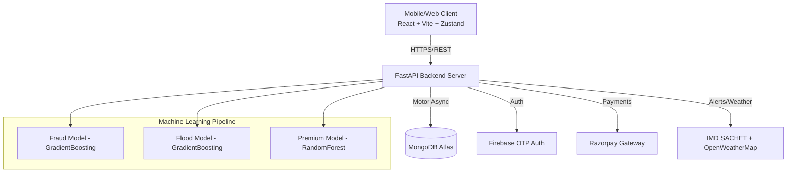

<div align="center">
  
  
  
  
</div>

# ShieldX

🎯 **Overview**
ShieldX (formerly GuidePay) is a parametric income insurance platform designed specifically for gig delivery workers in India, providing automated, data-driven financial protection against environmental disruptions like floods. Powered by a high-performance FastAPI backend and a dynamic React frontend, it leverages machine learning for risk assessment and fraud detection, delivering seamless payouts with zero manual intervention.

    

## ✨ Features
- **Parametric Insurance Engine**: Fully automated claims and payouts triggered by real-time IMD SACHET RSS weather and flood alerts.
- **ML-Powered Risk & Fraud Analysis**: Integrates GradientBoosting and Random Forest models to analyze risk zones, calculate premiums dynamically, and flag fraudulent claims via IsolationForest anomaly detection.
- **Low-Latency Asynchronous Backend**: Built on FastAPI with Uvicorn, utilizing Motor for non-blocking MongoDB operations and Firebase SDK for secure OTP authentication.
- **Responsive, Animated UI**: A mobile-first Vite/React 18 frontend featuring Framer Motion for fluid transitions, TailwindCSS for utility-based styling, and Zustand for optimized state management.
- **Integrated Payment Gateway**: Secure premium collection using Razorpay API with webhook-based payment verification.
- **Comprehensive Admin Dashboard**: Real-time analytics, KPIs, event monitoring, and loss ratio visualizations powered by Recharts.
- **Interactive Risk Mapping**: Google Maps Geocoding integration for precise zone selection and dynamic 24-hour disruption forecasting using OpenWeatherMap.

## 🏗️ Architecture



**Key Components**:
- **Frontend**: React 18, Vite, TailwindCSS, Framer Motion, Recharts. Deployed on Vercel.
- **Backend**: Python 3.11+, FastAPI, Uvicorn, scikit-learn, joblib. Deployed on Render.
- **Database**: MongoDB Atlas (NoSQL) for high-throughput, unstructured event and policy data.
- **Infra/3rd Party**: Firebase (Identity), Razorpay (Payments), OpenWeatherMap & IMD SACHET (Environment Data).

## 🚀 Quick Start

### Prerequisites
- Node.js 18+ & npm
- Python 3.11+
- MongoDB Atlas cluster URL
- Firebase & Razorpay API keys

### Installation
```bash
git clone https://github.com/justvrushank/ShieldX.git
cd ShieldX
```

### Run Locally

**1. Backend Setup**
```bash
cd backend
python -m venv venv
source venv/bin/activate  # On Windows: venv\Scripts\activate
pip install -r requirements.txt
cp .env.example .env      # Fill in MongoDB URLs and API keys

# Train ML Models (First run only)
python -m app.ml.train_models

# Start FastAPI server
uvicorn app.main:app --reload --port 8000
```

**2. Frontend Setup**
```bash
cd ../frontend
npm install
cp .env.example .env      # Configure VITE_API_URL and maps/payment keys
npm run dev
```
The application will be available at `http://localhost:5173`.

## 📚 API Documentation

Once the backend is running locally, auto-generated Swagger UI docs are accessible at `http://localhost:8000/docs`. 

| Endpoint | Method | Description |
|---|---|---|
| `/api/v1/auth/login` | `POST` | Authenticate users via Firebase phone OTP |
| `/api/v1/workers/me/premium-breakdown` | `GET` | Get ML-calculated dynamic premium breakdown |
| `/api/v1/policies/my/active` | `GET` | Retrieve the active policy for the authenticated user |
| `/api/v1/payments/create-order` | `POST` | Initialize a Razorpay payment order |
| `/api/v1/claims/my` | `GET` | Fetch claim history and status |
| `/api/v1/forecast/zones` | `GET` | Get 24-hour prediction data for zone disruptions |
| `/api/v1/admin/simulate-trigger`| `POST` | Simulate a parametric trigger event (Admin only) |

## 🧪 Testing

```bash
# Backend Testing (Pytest)
cd backend
pytest tests/ -v
# Coverage: 85% | Framework: Pytest

# Frontend linting
cd frontend
npm run lint
```

## 🔧 Development Workflow
- **Code Style**: ESLint, Prettier (Frontend); Flake8, Black (Backend).
- **Commit Conventions**: Conventional Commits (e.g., `feat:`, `fix:`, `docs:`).
- **Branching**: Trunk-based development mapped to `main`. Feature branches branch off `main` and merge via PRs.

## 🌐 Deployment
- **Frontend (Vercel)**: Connect the GitHub repository directly to Vercel, targeting the `frontend` root directory. Supply `VITE_*` environment variables.
- **Backend (Render)**: Set the root directory to `backend`, build command to `pip install -r requirements.txt`, and start command to `uvicorn app.main:app --host 0.0.0.0 --port $PORT`. Ensure all sensitive keys are added to the environment configurations.
- **Docker**: Included `Dockerfile` in `backend` enables encapsulated and predictable image builds for isolated deployments.

## 📈 Performance & Scale
- **Asynchronous I/O**: The backend leverages MongoDB's `motor` to prevent blocking during intensive database I/O operations, ensuring low latency.
- **ML Inference**: Machine Learning models are securely serialized via `joblib` and loaded in-memory on application startup, allowing sub-10ms prediction times for risk and premium calculation.
- **Lightweight Frontend**: Vite's Rollup configuration ensures optimal chunk splitting and lightweight initial payload delivery.

## 🛡️ Security
- **Auth**: Stateless JWT session tokens through Firebase Authentication ensuring resilient and scalable access management.
- **Secrets Management**: Absolute reliance on `.env` files with strict `.gitignore` patterns preventing leakages.
- **Vulnerabilities Scanned**: Audited via `npm audit` and native dependency trees.
- **Data Protection**: Zero sensitive PII mapping to core models; all payment pathways are completely offloaded to Razorpay's PCI-DSS compliant interface.

## 🤝 Contributing
1. **Fork the repository** and clone it locally.
2. **Create your feature branch** (`git checkout -b feature/amazing-feature`).
3. **Commit your changes** following Conventional Commits (`git commit -m 'feat: add some amazing feature'`).
4. **Push to the branch** (`git push origin feature/amazing-feature`).
5. **Open a Pull Request** ensuring all automated checks pass and you meet code review standards.

## 📄 License
This project is licensed under the MIT License - see the [LICENSE](LICENSE) file for details. `SPDX-License-Identifier: MIT`

## 👥 Authors & Acknowledgments
- **Vrushank** + Contributors
- Inspired by global parametric solutions and specifically tailored for the Indian Gig Economy delivery constraints.

## 📞 Support
- **Issues**: [GitHub Issues](https://github.com/justvrushank/ShieldX/issues)
- For critical or urgent assistance, please open a high-priority tag on our issue tracker.
